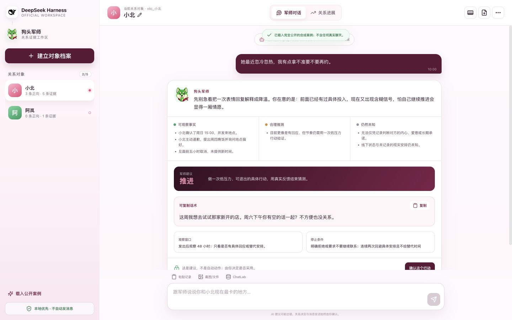
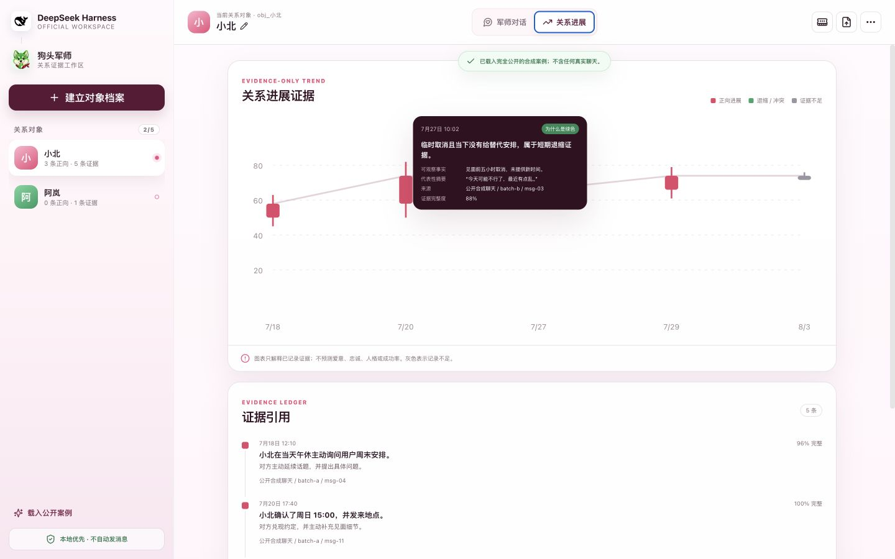

# 狗头军师 × DeepSeek Harness（GOAI 参赛版）

这是一个独立、可运行的 GOAI 参赛项目：官方 DeepSeek Harness 提供 Agent、工具、插件、会话与 Web 工作区底座；仓库既有“狗头军师” Skill 作为只读能力内核，通过新建适配层按需接入。

它不是一套仿 Harness 的普通页面。启动时会创建一个真实的 Harness profile，组合官方 `@deepseek-ai/dsh-base`、`@deepseek-ai/dsh-web-app` 与本项目 bundle，并由插件同时注册系统提示、Harness tools 和 Web client slots。



## 直接运行

要求：Node.js 22.19+、pnpm 10.15+、Python 3。

```bash
cd competition/deepseek-harness-goutoujunshi
pnpm install --frozen-lockfile
pnpm start
```

浏览器打开 `http://127.0.0.1:3186/`，点击“载入公开案例”。这个完整演示无需 API Key，也不需要任何真实聊天。若要让官方 Agent loop 调用狗头军师工具，可再从 Harness 设置中配置模型提供方。

如需改端口：

```bash
PORT=3190 pnpm start
```

## 一条完整的验收路径

1. 从空工作区点击“载入公开案例”，得到互相隔离的“小北”和“阿岚”两个稳定对象档案。
2. 切换对象，确认各自长期会话、精简记忆、证据和任务互不串联。
3. 在“小北”的“军师对话”中查看情绪承接、事实/合理推测/未知、推进建议、可复制话术、48 小时观察窗口和停止条件。
4. 只有点击“确认这个行动”后才记录人工确认；系统不会自动发消息。
5. 点击“关系进展”，悬停证据蜡烛查看时间、红/绿原因、可观察事实、消息摘要、来源与完整度。
6. 点击“添加关系证据”→“演示跨批次身份冲突停止”，确认 sender ID 映射冲突会立即暂停导入。
7. 点击“查看对象记忆”，验证当前对象限定、暂停/恢复、添加公开演示记忆与撤销。



## 功能边界

- 最多 5 个关系对象；稳定内部 ID 与可修改显示代号分离。
- 普通对话中自然建议建档，不把聊天上传设为必经流程。
- 原始聊天只属于本地证据层，不进入长期记忆；长期记忆只保存 `user`、`object`、`relationship`、`event`、`hypothesis` 五类精简记录。
- 旧事件按阶段压缩，近期保留细节；召回时只允许当前对象和当前问题相关内容。
- 身份优先使用 sender/member ID、账号和会话元数据；缺少元数据时要求用户确认锚点，冲突时停止。
- 关系蜡烛只解释已经记录的证据。红色是正向进展，绿色是退缩/冲突/投入下降，灰色是证据不足；不预测爱意、忠诚、人格或成功率。
- 支持按需粘贴、截图/文件、ChatLab 和用户明确授权的电脑只读入口；不解密数据库、不绕过权限、不后台监控、不自动发消息。

## 验证

```bash
pnpm run test:all
pnpm run check:readonly
```

`check:readonly` 会把受保护的既有 Skill 文件与当前仓库默认分支快照对比，防止比赛项目误改根 `SKILL.md`、`references/**`、既有 `agents/**` 和 `scripts/memory_store.py`。

## 项目结构

```text
competition/deepseek-harness-goutoujunshi/
├── packages/goutoujunshi-bundle/       # 官方 Harness profile 可组合 bundle
├── packages/goutoujunshi-plugin/       # host tools、提示、client slots、UI 与领域逻辑
├── scripts/                             # profile 初始化、启动、只读边界检查
├── tests/                               # 对象、身份、证据、记忆、路由测试
├── docs/                                # 架构、演示、安全、上游锁定与视觉 QA
└── artifacts/screenshots/               # 公开合成案例的浏览器 QA 证据
```

更多说明：

- [架构与隔离设计](docs/ARCHITECTURE.md)
- [公开 Demo 脚本](docs/DEMO.md)
- [数据与安全边界](docs/DATA_AND_SAFETY.md)
- [上游版本锁定](docs/UPSTREAM.md)
- [浏览器与设计 QA](docs/DESIGN_QA.md)
- [第三方声明](THIRD_PARTY_NOTICES.md)
